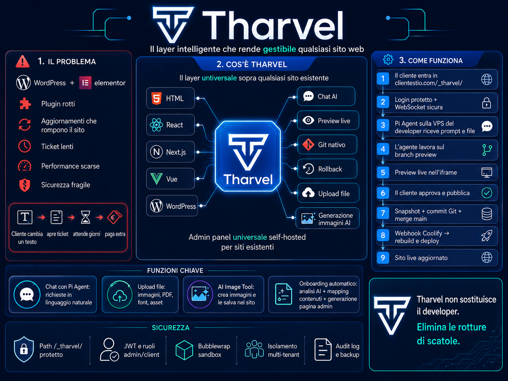

<p align="center">
  
</p>

# Tharvel

**Admin panel universale, self-hosted, per siti web già esistenti.**
Trasforma un repo HTML / Astro / Next / Vue (e in futuro WordPress) in un sito gestibile dal cliente via chat AI, preview live e pubblicazione esplicita — senza ricostruire nulla e senza dipendere da WordPress + Elementor.

Il cuore è [Pi Agent](https://github.com/mariozechner/pi-coding-agent) (SDK TypeScript) wrappato con tool custom (upload immagini con Sharp, generazione immagini AI, file manager). Il flusso è git-native: l'agente lavora su un branch `preview`, auto-commit per turn riuscito, push su `main` solo quando il cliente preme "Pubblica" → webhook Coolify → rebuild automatico.

> Per la visione completa, le decisioni architetturali e la roadmap → vedi `progetto-tharvel.md` e la sintesi navigabile `tharvel-documentazione.html`.

---

## Architettura in 30 secondi

**Un solo container Tharvel sulla VPS del developer** serve tutti i siti dei clienti. I repo dei clienti restano puliti, zero codice Tharvel al loro interno. Routing per tenant via `Host header` o query string `?site=<slug>`.

```
cliente.com/tharveladmin
   ↓ Nginx/Traefik (host=cliente.com, path=/tharveladmin)
   ↓ proxy_pass + X-Forwarded-Host
Tharvel App :3000
   ↓ DB lookup tabella `sites` (domain → cwd_path → framework)
Pi Agent con cwd = /var/tharvel/sites/<slug>/
```

Storage = SQLite (`better-sqlite3`) su volume dedicato. Vedi `progetto-tharvel.md` §7 per i dettagli.

---

## Stack

| Layer | Tech |
|---|---|
| UI | Vue 3 + Vite + Tailwind |
| Server | Node.js 22 + Express 5 + WebSocket (ws) |
| AI | Pi Agent SDK (`@mariozechner/pi-coding-agent`) |
| Storage | SQLite via `better-sqlite3` |
| Auth modelli AI | OAuth Codex (ChatGPT Plus/Pro) o API key (BYOK) |
| Build immagini | Sharp |
| Deploy | Docker multi-stage + Coolify v4 |

---

## Struttura repo

```
Tharvel/
├── Tharvel.png                       # logo / hero
├── README.md                         # questo file
├── Dockerfile                        # multi-stage: target `server` + `ui`
├── docker-compose.yml                # replica locale ambiente Coolify
├── .gitignore / .dockerignore
│
├── progetto-tharvel.md               # visione + architettura
├── progetto-tharvel-backup.md        # piano backup/restore (restic + OVH S3)
├── progetto-tharvel-security.md      # roadmap sicurezza (4 strati)
├── tharvel-documentazione.html       # sintesi navigabile dei 3 .md sopra
│
└── tharvel/                          # app vera
    ├── package.json                  # workspace npm: server, ui, shared
    ├── dev.sh                        # dev locale: due gnome-terminal (server + ui)
    ├── server/
    │   ├── index.ts                  # entry point Express + WS + Pi Agent dispatch
    │   ├── overlay.html              # CSS+JS overlay Alt+click iniettato nei siti
    │   ├── db/
    │   │   ├── index.ts              # init SQLite (env: THARVEL_DB_PATH)
    │   │   ├── schema.sql            # tabella `sites`
    │   │   ├── sites.ts              # CRUD helpers
    │   │   └── seed.ts               # seed idempotente (demo + restaurant)
    │   ├── scripts/
    │   │   ├── onboard.ts            # CLI pipeline onboarding completo (clone+build+register)
    │   │   ├── register-site.ts      # CLI registra un sito in DB
    │   │   └── login-codex.ts        # OAuth ChatGPT Plus/Pro → ~/.pi/agent/auth.json
    │   └── assets/                   # cartella upload runtime (gitignored)
    ├── ui/                           # Vue 3 + Vite (chat + preview iframe + pannelli)
    ├── shared/                       # placeholder per tipi condivisi
    ├── data/                         # SQLite DB runtime (gitignored)
    ├── logs/                         # log dev (gitignored)
    └── sites/                        # symlink/clone dei siti gestiti (gitignored)
```

---

## Come avviarlo

### A. Dev locale (sulla macchina del developer)

**Prerequisiti:** Node.js 22+ via nvm, `gh` CLI (consigliato), `gnome-terminal` per `dev.sh`.

```bash
cd tharvel
npm install                              # installa workspaces (server + ui + shared)
npm run login:codex --workspace=server   # OAuth a ChatGPT (apre browser, callback :1455)
npm run seed --workspace=server          # popola DB con i siti seed (demo, restaurant)
./dev.sh                                 # avvia server :3000 + UI :5173 in due terminali
```

Apri `http://localhost:5173/tharveladmin/?site=<slug>` (default: `demo`).

> **Conflitto porte:** il callback OAuth di Codex è hardcoded su `127.0.0.1:1455`. Se BrowserOS o altro processo la occupa, il login fallisce con messaggi fuorvianti. Diagnosi: `ss -ltnp | grep ':1455'`.

### B. Produzione su Coolify (VPS)

Coolify deploya **due application separate** dallo stesso repo:

1. **tharvel-server** — Dockerfile target = `server`, port `3000`
2. **tharvel-ui** — Dockerfile target = `ui`, port `5173`

#### Build & deploy

In Coolify, per ogni servizio:
- Source: GitHub → `cristal-orion/Tharvel`, branch `main`
- Build pack: **Dockerfile**
- Build context: `.` (root)
- Target: `server` o `ui` (configurabile in Coolify v4 sotto build config)

#### Variabili d'ambiente (tharvel-server)

| Variabile | Valore consigliato | Default | Uso |
|---|---|---|---|
| `NODE_ENV` | `production` | — | Modalità runtime |
| `PORT` | `3000` | `3000` | Porta HTTP/WS |
| `THARVEL_DB_PATH` | `/data/tharvel.db` | `tharvel/data/tharvel.db` | File SQLite |
| `THARVEL_SITES_ROOT` | `/var/tharvel/sites` | `tharvel/sites/` | Root dei cloni siti |

#### Volumi persistenti (tharvel-server)

| Mount | Contiene | Backup priorità |
|---|---|---|
| `/data` | `tharvel.db` + WAL files | **A** — Tier A in `progetto-tharvel-backup.md` |
| `/var/tharvel/sites` | Cloni Git dei siti gestiti | **A** — escludere `node_modules`, `dist`, cache |

#### Login modello AI (post-deploy, una volta)

Da una shell nel container `tharvel-server`:
```bash
npm run login:codex --workspace=server
```
Salva in `~/.pi/agent/auth.json` (volume utente del container, **fuori dal repo**). Da rifare ad ogni redeploy se il volume utente non è persistito.

---

## Onboarding di un nuovo sito cliente

Lo script `tharvel onboard` automatizza il flusso completo (validato sul campo 2026-05-12).

```bash
cd tharvel/server

# Modalità A — sito già su Git (caso prod)
npm run onboard --workspace=server -- \
  --repo git@github.com:cliente/sito.git \
  --slug cliente1 \
  --domain cliente1.com
  # --framework astro|html  (opzionale, auto-detect da package.json)

# Modalità B — cartella locale (dev sulla macchina del developer)
npm run onboard --workspace=server -- \
  --slug industrial \
  --local-path /home/michele/Desktop/Progetti/IS \
  --framework astro
```

**Cosa fa lo script:**
1. Valida slug `[a-z0-9-]{1,31}` + verifica unicità in DB
2. Clone (`--repo`) o symlink (`--local-path`) in `${THARVEL_SITES_ROOT}/<slug>/`
3. Auto-detect framework (`astro` se `package.json` ha `astro` in deps, altrimenti `html`)
4. Build iniziale per SSG (`npm install && npm run build`) — bypassabile con `--skip-build`
5. INSERT nella tabella `sites`
6. Stampa URL di test (`http://localhost:5173/tharveladmin/?site=<slug>`)

**Da fare manualmente in prod (TODO automazione):**
- Aggiungere routing Traefik per `https://<domain>/tharveladmin → tharvel-server:3000`
- Deploy key per-repo via `gh repo deploy-key add` (l'implementazione automatica attende verifica `gh` auth sulla VPS)

---

## Scripts npm utili

| Comando | Workspace | Scopo |
|---|---|---|
| `npm run dev` | server, ui | Watch dev (tsx watch / vite) |
| `npm run seed` | server | Seed idempotente DB |
| `npm run register:site` | server | INSERT raw in tabella `sites` |
| `npm run onboard` | server | Pipeline onboarding completa |
| `npm run login:codex` | server | OAuth ChatGPT → `~/.pi/agent/auth.json` |
| `npm run build` | ui | Build Vue+Vite → `ui/dist/` |

---

## Decisioni architetturali (riepilogo)

- **2026-05-07 — Multi-tenancy centralizzata**: un container, zero codice Tharvel nei repo cliente, routing via Host header → tabella `sites`. Vedi `progetto-tharvel.md §4.2`.
- **2026-05-08 — Storage SQLite**: better-sqlite3 su volume `/data`. Trigger di migrazione a Postgres documentati. Vedi `progetto-tharvel.md §7.2`.
- **2026-05-10 — Auto-commit policy**: SÌ su branch `preview` dopo turn riuscito, push solo da "Pubblica". Vedi `progetto-tharvel.md §6.4.1`.
- **2026-05-12 — Deployment**: monorepo GitHub privato, Dockerfile multi-stage con target `server` + `ui` separati, tsx in prod per Beta.

---

## TODO bloccanti per il primo deploy reale

- [ ] `tharvel/ui/src/site.ts:8` — `SERVER_BASE` è hardcoded a `http://localhost:3000`. Va reso relativo (`window.location.origin`) o env-driven prima che la UI in container funzioni.
- [ ] Routing Traefik dinamico nello script `onboard` (richiede conferma del path `dynamic/` su Coolify v4, default `/data/coolify/proxy/dynamic/`).
- [ ] `gh repo deploy-key add` integration in `onboard` per clone dei repo cliente con deploy key per-sito.
- [ ] Server `/api/health` endpoint per healthcheck Docker.

## TODO Beta privata

- [ ] Bubblewrap sandbox per isolamento agent (Strato 3a — `progetto-tharvel-security.md`)
- [ ] Identity/JWT con `jose` (Strato 4 — `progetto-tharvel-security.md`)
- [ ] Backup automatici via restic + OVH Object Storage (`progetto-tharvel-backup.md`)
- [ ] Restore drill completo eseguito almeno una volta

---

## Riferimenti

- **Documenti strategici**: `progetto-tharvel.md`, `progetto-tharvel-backup.md`, `progetto-tharvel-security.md`
- **Sintesi navigabile**: `tharvel-documentazione.html` (apribile in browser)
- **Pi Agent SDK**: https://github.com/mariozechner/pi-coding-agent
- **Coolify**: https://coolify.io
